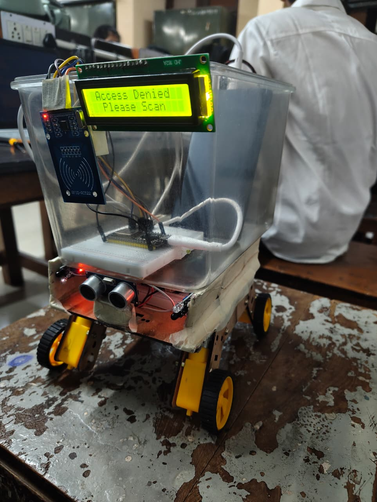
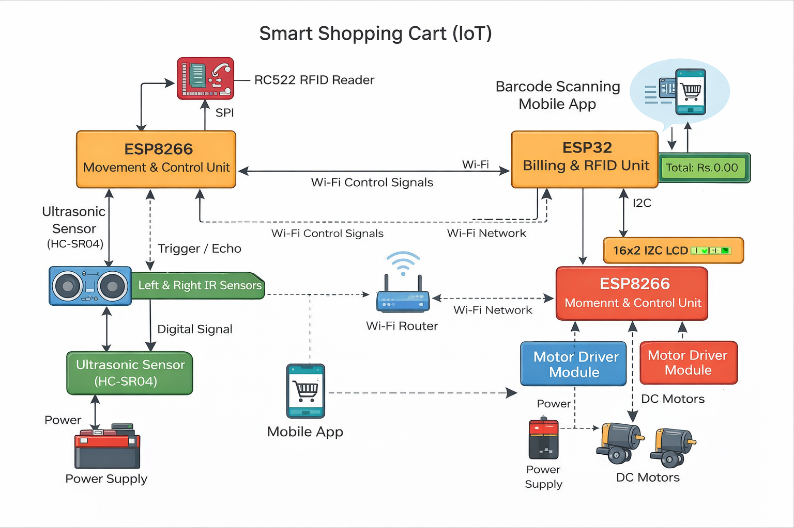

# Smart Shopping Cart (IoT)

An IoT-based smart shopping cart designed to automate in-store billing and provide hands-free cart movement using sensors, RFID authentication, and wireless communication.

---

## 📌 Overview

The Smart Shopping Cart improves the retail shopping experience by allowing users to scan products while shopping and track their total bill in real time, eliminating the need for traditional checkout counters.

In addition, the cart autonomously follows the user using IR and ultrasonic sensors, reducing physical effort and enhancing convenience.

The system uses a **dual-microcontroller architecture**:
- **ESP32** handles billing, RFID authentication, LCD display, and mobile app communication  
- **ESP8266** handles motor control and autonomous cart-following behavior  

---

## 🛒 Prototype Preview

### Front View


### Side View


---

## 🧠 System Architecture



**Data Flow Overview:**
1. User authenticates using an RFID card  
2. ESP32 grants access and initializes the system  
3. Products are scanned via a mobile app and sent to ESP32  
4. The total bill is updated and displayed on the LCD  
5. ESP8266 continuously tracks user position and controls motor movement  

---

## ✨ Key Features

- RFID-based user authentication  
- Barcode-based product scanning via mobile app  
- Real-time bill display on LCD  
- Autonomous cart-following using IR and ultrasonic sensors  
- Dual-microcontroller design for parallel task execution  

---

## 🔧 Hardware Components

- ESP32  
- ESP8266 (NodeMCU)  
- RC522 RFID Module  
- Ultrasonic Sensor (HC-SR04)  
- IR Sensors  
- Motor Driver Module  
- DC Motors and wheels  
- 16×2 I2C LCD Display  
- Power supply  

---

## 💻 Software Stack

- **Firmware:** Arduino (ESP32 & ESP8266)  
- **Communication:** Wi-Fi (HTTP)  
- **Display:** I2C LCD  
- **Mobile App:** Barcode-based product scanning  

---
## ⚙️ Working Principle

- System initializes sensors, motors, RFID module, and LCD

- User scans an authorized RFID card

- ESP32 connects to Wi-Fi and enables billing mode

- Products are scanned via the mobile app

- ESP8266 follows the user using distance and direction data

- Final bill is displayed on the LCD

---

## 🚀 Future Improvements

- Online payment gateway integration

- AI-based vision tracking using camera and OpenCV

- Voice-controlled navigation

- Advanced obstacle avoidance

- Cloud-based billing and e-receipt generation

---

## 📂 Repository Structure

```text
firmware/
├── esp8266_movement/        # Auto-follow and motor control
└── esp32_billing_rfid/      # RFID authentication & billing

hardware/
├── components_list.md
└── pin_connections.md

docs/
└── project_report.pdf

images/
└── Project photos and system diagrams


